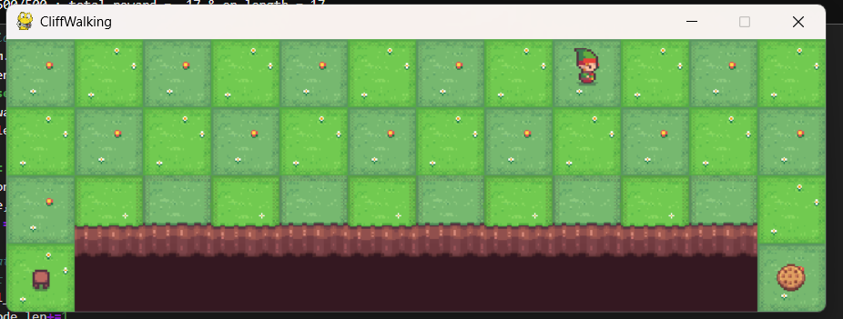
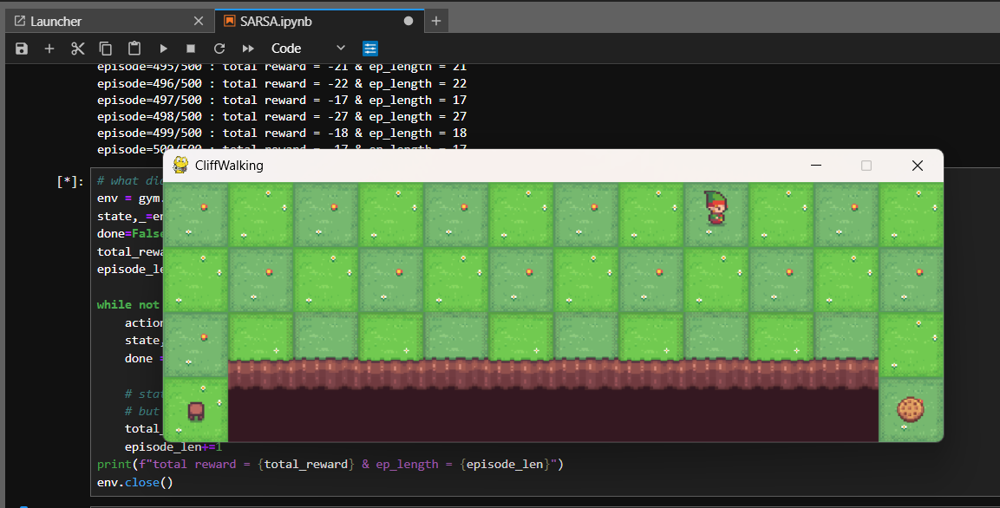
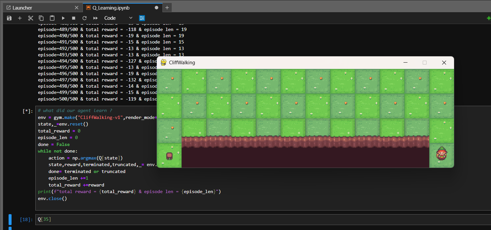

#  🏔️ Cliff Walking using Reinforcement Learning

This repository demonstrates the implementation of two fundamental **Reinforcement Learning (RL)** algorithms:

* ✅ Q-Learning (Off-policy)
* ✅ SARSA (On-policy)

using the classic **Cliff Walking problem**.

---

## 📌 Problem Description

The **Cliff Walking environment** is a grid-world problem where:

* The agent starts at a fixed position
* The goal is to reach the destination
* The bottom row contains a **cliff region**

### ⚠️ Rewards:

* Each step → **-1**
* Falling into cliff → **-100**
* Goal reached → episode ends

👉 The challenge is to learn an **optimal policy** while avoiding the cliff.

---

## 🟢 Environment Visualization



---

## 🧩 Algorithms Implemented

### 🔹 Q-Learning (Off-policy)

* Learns the **optimal policy**
* Uses the **maximum future reward**

```
Q(s,a) = Q(s,a) + α [ r + γ max Q(s',a') - Q(s,a) ]
```

👉 It assumes the agent always takes the **best possible next action**

---

### 🔹 SARSA (On-policy)

* Learns based on **actual actions taken**
* More **realistic and safer learning**

```
Q(s,a) = Q(s,a) + α [ r + γ Q(s',a') - Q(s,a) ]
```

👉 It follows the **current policy**

---

## 📸 Results

### 🔵 SARSA Learned Policy (Safer Path)



👉 SARSA avoids the cliff and learns a **safe but slightly longer path**

---

### 🔴 Q-Learning Learned Policy (Optimal but Risky)



👉 Q-learning learns the **shortest path near the cliff**, which is optimal but risky

---

## ⚡ Key Difference (Very Important)

| Feature  | Q-Learning       | SARSA           |
| -------- | ---------------- | --------------- |
| Type     | Off-policy       | On-policy       |
| Learning | Greedy (optimal) | Policy-based    |
| Behavior | Risky            | Safe            |
| Path     | Near cliff       | Away from cliff |

---

## 📊 Insights

* Q-learning → **Higher reward but risky**
* SARSA → **Safer and stable learning**
* Shows trade-off between:

  * ⚡ Optimality
  * 🛡️ Safety

---

## 📁 Project Structure

```
CliffWalking/
 ├── Q_learning.ipynb
 ├── SARSA.ipynb
 ├── images/
 │    ├── env.png
 │    ├── SARSA.png
 │    ├── Q_learning_output.png
 └── README.md
```

---

## 🚀 How to Run

1. Clone the repository:

```
git clone https://github.com/LikithaKodidela/CliffWalking.git
```

2. Open Jupyter Notebook:

```
jupyter notebook
```

3. Run:

* `Q_learning.ipynb`
* `SARSA.ipynb`

---

## 🎯 Learning Outcomes

* Temporal Difference Learning
* On-policy vs Off-policy learning
* Exploration vs Exploitation trade-off
* Practical RL intuition

---

## 🌟 Future Improvements

* Add reward vs episodes graph 📈
* Convert to Deep Q-Network (DQN)
* Add GIF animation of agent

---

## 🤝 Contributing

Feel free to fork and improve 🚀

---

## 📌 Author

👤 Likitha Kodidela

---

## ⭐ If you found this helpful, give it a star!
